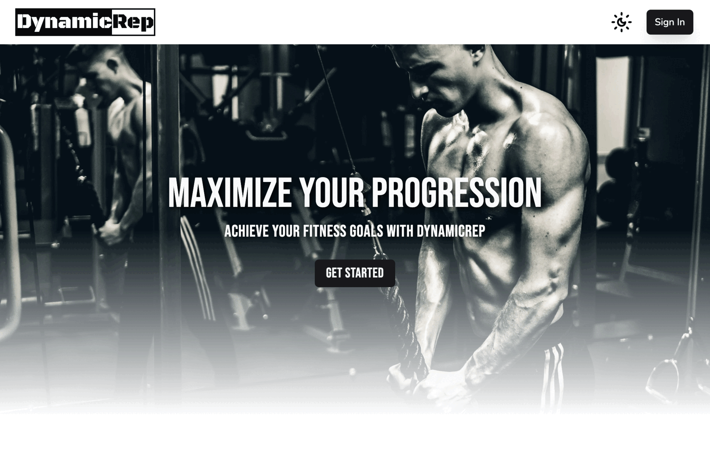
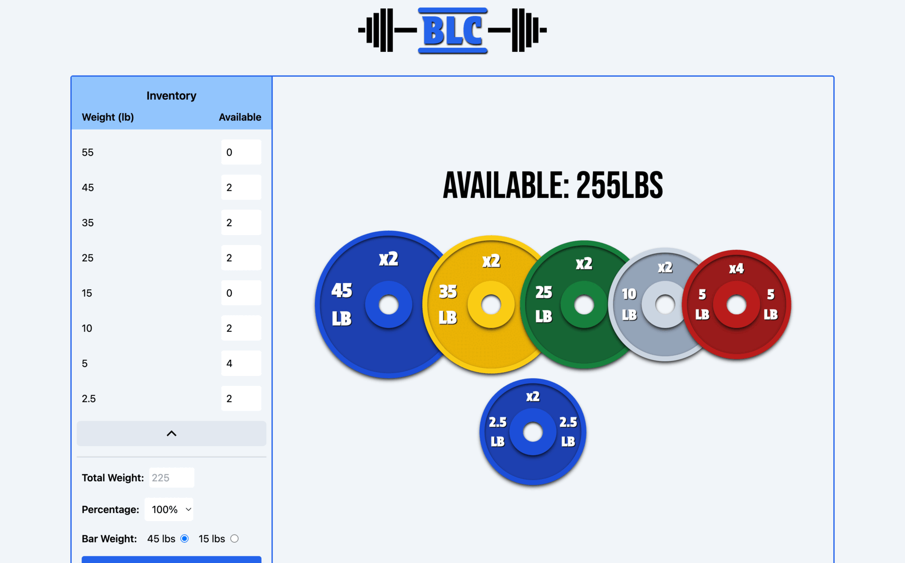

 

I'm a frontend developer passionate about building sleek, user-friendly interfaces and solving real-world problems through code.

<h1 align='center' >Projects</h1>

<table>
<tr>
    <td width='50%' valign='top'>
      
      <h3 align='center'><a href="https://dynamic-rep.vercel.app/" target='_blank' >DynamicRep</a></h3>
      

        A full-featured workout logger designed for efficient exercise tracking. It utilizes Supabase for
authentication & database management, React Hook Form for seamless input handling, and TanStack
Table for interactive data visualization.
      

    </td>
    <td width='50%' valign='top'>
      
      <h3 align='center'><a href="https://barbell-load-calculator.netlify.app/" target='_blank'>Barbell Load Calculator</a></h3>
      

        A React-based weight plate calculator that allows lifters to quickly determine the exact plates needed for
a barbell setup. Built with React Context API, local storage, and a responsive UI using Tailwind CSS.
      

    </td>
  </tr>
</table>

<h3 align='center'>Technologies I use</h3>

